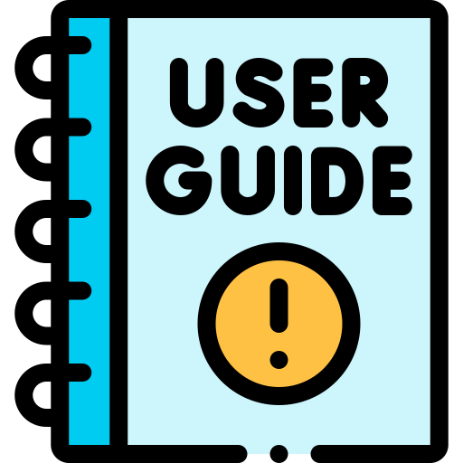

<h1 align="center"> <strong align="center"> Code Challenge - Bibicí Níus </strong> </h1>

    

 

<h2> Descrição </h2>

 Bibici Nius is my solution to a coding challenge. 

 

<b> Coding challenge statement </b>

 

 This page consists a coding challenge for Data Engineering roles. 

 

<b> Purpose </b>

 

 Aim of this test is three fold:
    <ul>
        <li>Evaluate your coding abilities;</li>
        <li>Judge your technical experince;</li>
        <li>Understand how you design a solution</li>
    </ul>

 

<b> How you will be judged? </b>

 

 You will be scored on:
    <ul>
        <li>Coding standard, comments and style;</li>
        <li>Overall solution design;</li>
        <li>Appropriate use of source control</li>
    </ul>

 

<b> Intructions </b>

 

 Please create a free account in <a href="https://cloud.google.com/free" target="_blank"> GCP </a>

 Candidate should put their test results on a public code repository hosted on Github. 

 Once test is completed please share the Github repository URL to hiring team so they can review your work.

 You are building a backend application and <u>no UI is required</u>, input can be provided using a configuration file or command line 

 

<b> Challenge - News Content Collect and Store </b>

 

 Create a solution that crawls for articles from a news website, cleanses the response, stores in BigQuery (bonus) then makes it available to search via an API. 

 

<b> Details </b>

 

 Write an application to crawl an online news website, e.g. <a href="https://www.theguardian.com/au" target="_blank"> The Guardian </a> or <a href="https://www.bbc.com" target="_blank"> BBC </a> using a crawler framework such as <a href="http://scrapy.org/" target="_blank"> Scrapy </a>. You can use a crawl framework of your choice and build the application in Python. 

 

 The appliction should cleanse the articles to obtain only information relevant to the news story, e.g. article text, author, headline, article url, etc. Use a framework such as Readability to cleanse the page of superfluous content such as advertising and html. 

 

 Store the data in BigQuery, for subsequent search and retrieval. Ensure the URL of the article is included to enable comparison to the original. 

 

<b> Bonus </b>

 

 Write an API that provides access to the content in BigQuery database. The user should be able to search for articles by keyword. 

 

  

    
      <adress>
        Icons made by (from <a href="https://www.flaticon.com/br/" target="_blank" title="Flaticon"> www.flaticon.com</a> and <a href="https://icon-icons.com/pt/" target="_blank" title="Icon-Icons">www.icon-icons.com/pt/</a>):
        <ul>
          <li><a href="https://www.pngfuel.com/free-png/wmpfw" target="_blank" title="pngfuel">Free-png</a>;</li>
          <li><a href="https://www.flaticon.com/br/autores/freepik" target="_blank" title="Freepik">Freepik</a>;</li>
        </ul>
      </adress>
    
  

 

<h2> How to use? </h2>

  <ul>
    <li> Download the repo and run <code> app.py </code></li>
    <li> Click on the link that appears in the terminal output </li>
    <li> In the search bar, add on the end of the URL <code> /Article/*KEYWORD* </code> (to search for a specific keyword) or <code> /AllArticles </code> (to search all articles in the database - around 30 articles).
    </li>
  </ul>

 

<h2> Improvment opportunities </h2>

 

  
 I didn't have enough time to learn how to:

    <ul>
      <li> Implement the input using a configuration file or command line: </li>
      <li> Improve data access control in BigQuery. </li>
    </ul>
  
 I believe these would be the improvements for the next steps. 

 

<h2> Autor </h2>

<a href="https://www.linkedin.com/in/vini-antunes/" target="_blank">
 
<b>Vini Antunes</b>
</a>
